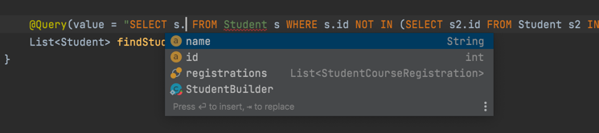

# Spring + JPA + Hibernate test

## Quick links:

* [Entities](/src/main/java/com/school/registration/model)
* [StudentRepository](/src/main/java/com/school/registration/repository/StudentRepository.java)
  (using basically Spring data JPA with some custom queries. Transactional part would be done in the service class - I
  added a draft of the student creation
  [here](/src/main/java/com/school/registration/service/StudentService.java))
* [DDL](/src/main/resources/db/migration/V1.0__Student_Course.sql) using H2 language to make the setup easier

## A little about my experience and my suggestion on how improve relationships/queries with Hibernate

### Hibernate "issues"

Hibernate has the problem with "hidden" queries, specially when you have relationships that are explicitly or implicitly
lazy. Your code might execute multiple queries to bring that lazy data or even throw a LazyInitializationException if
that entity leaves the code that holds the session and you try to access the data. The best way I can see to solve this
issue is to use [@EntityGraph](https://www.baeldung.com/spring-data-jpa-named-entity-graphs) on the repository methods (
either with ad-hoc or with @NamedEntityGraph). If you need multiple entity graphs for the same method you have to split
that into multiple repositories though. There's also
an [interesting project](https://github.com/Cosium/spring-data-jpa-entity-graph) that I haven't used yet but apparently
allows you to pass a custom entity graph while calling the repository, for more fine-grained options. This is still
something error-prone since the only way to check if there's a performance bottleneck related to badly a designed
relationship/entity graph is only seen when you check the Hibernate output query.

### Hibernate vs JOOQ

Most recently I worked in a project that used [JOOQ](https://www.jooq.org/) for everything DB related (from simple CRUD
applications to complex queries such as batch updates and reporting). JOOQ enables the development of type safe queries
in Java, which makes it a more SQL approach (where Hibernate would be a domain approach). The downside of JOOQ is that
everything seems very manual, specially when you are talking about complex updates where you have a data model that
looks more like a graph. Hibernate shines when it comes to these complex updates, but it becomes hard when you are
looking into more complex queries. If using Intellij IDEA Ultimate, we could emulate the type safety of JOOQ with the
feature that enables the use of JPQL with some UI help (autocompletion, error messages):

## Summary of recommendations

* Make use of @EntityGraph for select queries when you know beforehand that the relationships will be needed. Another
  option is to use FETCH JOIN in a custom query with the downside of bypassing
  the [Spring data JPA method-based queries](https://docs.spring.io/spring-data/jpa/docs/current/reference/html/#jpa.query-methods.query-creation) (
  and now have a custom query to maintain)
* Don't let the class that holds the Hibernate session return an @Entity, always convert to some dto that is a
  projection of that data (to avoid LazyInitializationException)
* For reporting (multiple tables involved, complex relationships) or batch update queries, use Spring data JPA Custom
  queries or JOOQ